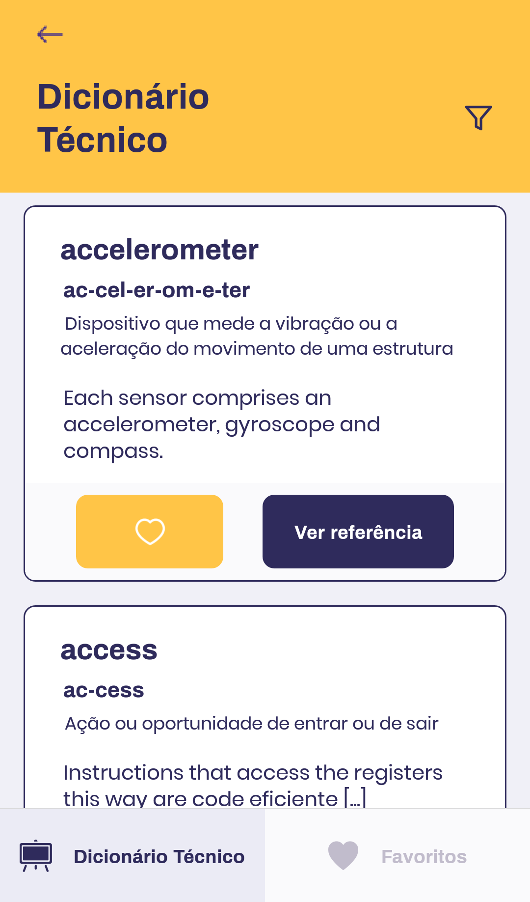
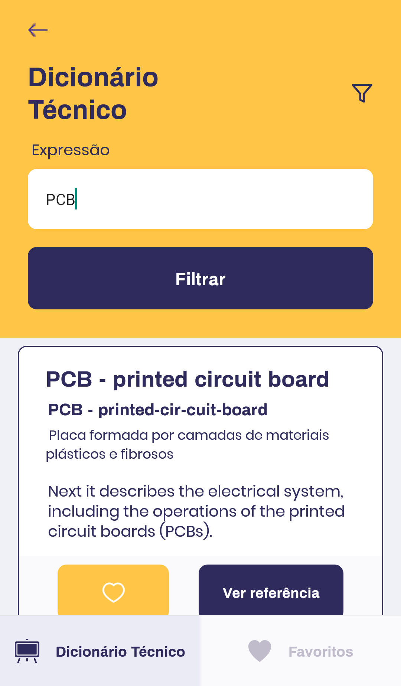
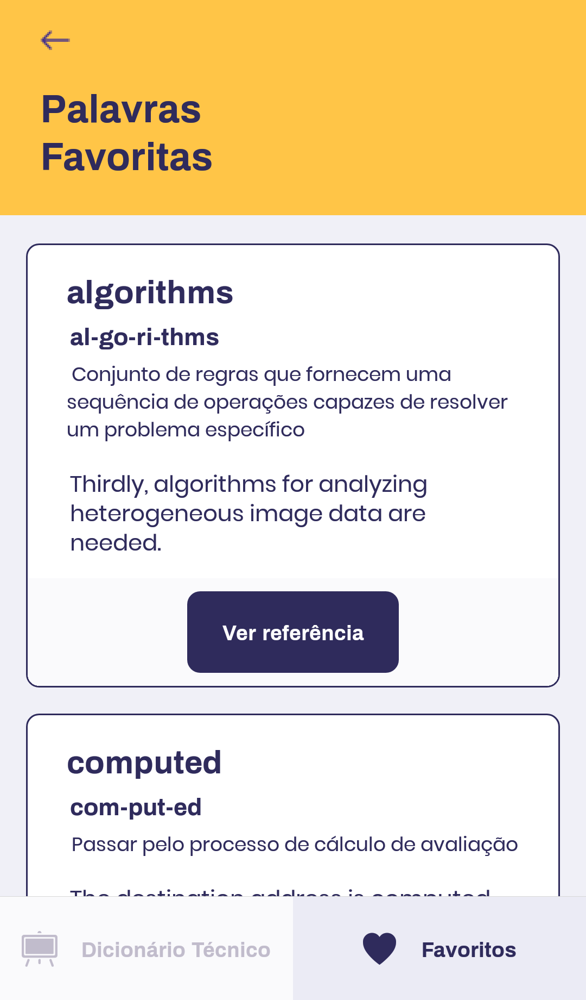

<h1 align="center" >DicTech</h1>
 

## 🚀 Tecnologias

Esse projeto foi desenvolvido com as seguintes tecnologias:

- [React Native](https://facebook.github.io/react-native/)
- [Expo](https://expo.io/)
- [TypeScript](https://www.typescriptlang.org/)

## 💻 Projeto

O DichTech é uma aplicação útil para técnicos que precisam conhecer alguns termos em inglês que precisam em um só lugar!

  
  _______
  

  
  _______
  

## **Criado por Gabriel Silva**
